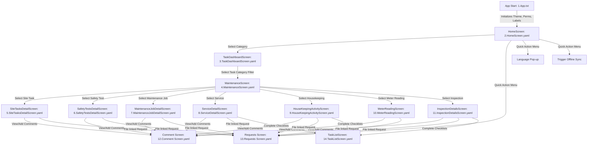

# Elite Screens - Power Apps Canvas Application Summary

This document provides a comprehensive architectural and functional summary of the **Elite Screens** project. The project consists of screen definitions and app logic exported from a Microsoft Power Apps Canvas Application, serialized in YAML and text formats.

---

## 1. Project Overview

**Elite Screens** is a mobile/tablet-optimized field services and task management application designed for operations, safety inspections, asset maintenance, and logging field work. It enables operators, engineers, and supervisors to view, track, log, and submit work in real-time, with support for:
- **Role-based and team-based task filtering** (viewing tasks assigned to teams vs. individuals).
- **Offline Sync Capabilities** (handling offline queues and records).
- **Localization/Multi-language Support** (dynamic translation of labels and instructions).
- **Time Tracking** (timers to record durations directly on task detail views).
- **Checklist/Sub-task completion** for compound actions.
- **Dynamic Context-aware Comments and Request submissions**.

---

## 2. Core Navigation Flow & Architecture

The application is structured around a central Home Screen that routes users to functional dashboards and master-detail logs. Below is the navigation architecture of the application:

---

## 3. Screen-by-Screen Detailed Analysis

Here is a breakdown of what each code file represents in the application context:

### 1. Root Application Config (`1.App.txt`)
- **Purpose**: Global app initializer.
- **OnStart Script**:
  - Sets up global UI variables (`IsHomeScreenLoaderVisible`).
  - Defines the global design system theme (`Theme_OnStart` and `EliteTheme`), setting specific colors (primary, status badges, menu light backgrounds), fonts (`Lato`), and responsive font size scales for different screen sizes (Small, Medium, Large, ExtraLarge).
  - Initializes the main navigation menu schema (`MenuList`) outlining names, icons, colors, and key permission mappings (`elt_menukey`).
  - Implements role-based security filtering (`MenuFilteredFromPermission`) by retrieving user menu permissions from a Power Automate flow (`PowerAppV2->Listrows`) and mapping it against the logged-in user profile (`LookUp(Users, 'Primary Email' = User().Email)`).
  - Resolves active languages and loads translations (`LabelTranslations`) by fetching details from `Languages` and `Translations` tables.
- **Start Screen**: Directed to `HomeScreen`.

### 2. Home Screen (`2.HomeScreen.yaml`)
- **Purpose**: The user's landing page containing primary module tiles.
- **Components**:
  - **User Profile Display**: Dynamically loads the current user's image (`User().Image`) and a localized welcome greeting.
  - **Module Tile Gallery (`MainMenuGallery`)**: A grid displaying menu options (Site Tasks, Safety Tests, Maintenance Jobs, Services, Housekeeping, Meter Readings, Inspections) dynamically filtered by user access.
  - **Quick Action Menu**: A slide-out panel allowing the user to select their interface language, trigger offline sync (`ShowHostInfo(HostInfo.OfflineSync)`), or file standalone user **Requests**.
  - **Elite Screens Brand Logo**: Displayed prominently in the container.

### 3. Task Dashboard Screen (`3.TaskDashboardScreen.yaml`)
- **Purpose**: Aggregate dashboard summarizing tasks for the selected module.
- **Components**:
  - Displays counting badges for tasks grouped into status buckets:
    - **High Priority**: Uncompleted tasks with `Priority = 1`.
    - **To Do**: Tasks with due date $\le$ today.
    - **Next 7 days**: Tasks with due dates within the upcoming week.
    - **Completed**: Tasks marked complete (status code = 4).
    - **All**: Total active/uncompleted tasks.
  - **Toggle Switch (`TaskDashboard_TaskFilter_Toggle`)**: Shifts filters between tasks assigned to the user's specific teams (`UserTeams`) versus tasks assigned to the user individually ("Mine").
  - Routing buttons navigate the user to the `MaintenanceScreen` with the selected status filter pre-loaded.

### 4. Maintenance / List Screen (`4.MaintenanceScreen.yaml`)
- **Purpose**: Master listing screen for records of the chosen category (e.g. Services list, Inspections list, etc.).
- **Components**:
  - Renders a list of items (`FilterRecordsToDisplay`) matching the dashboard filter.
  - Features search capabilities via text input (`TextInputCanvas3`) filtering results dynamically.
  - Displays critical info on items: Name, Location Code, Due Date, Priority indicator, and current progress.
  - Routes clicking an item to its specific detail screen.

### 5. Detail Screens (`5` - `11` YAML files)
These screens display granular data for specific records and allow workers to execute actions.

- **Site Tasks Detail Screen (`5.SiteTasksDetailScreen.yaml`)**:
  - Displays specific details of a Site Task record (Status, Owner, Target Date, Location).
  - Allows requesting more information or raising new requests.
- **Safety Tests Detail Screen (`6.SafetyTestsDetailScreen.yaml`)**:
  - Displays safety test protocols, tester information, test schedules, and compliance statuses.
- **Maintenance Job Detail Screen (`7.MaintenanceJobDetailScreen.yaml`)**:
  - Features time-logging logic. Integrates a timer component (`Timer1`) that computes duration spent on the job, displaying sum totals from `Time Entries` table.
  - Allows changing the Job Status (loading localized statuses from the `Job Statuses` table).
- **Service Detail Screen (`8.ServiceDetailScreen.yaml`)**:
  - Displays service ticket details.
  - Implements advanced timer control buttons: **Start** (creates new active Time Entry record), **Pause** (stops timer and saves duration), and **Complete** (finalizes the service).
  - Provides navigation links to check off itemized sub-tasks/checklists (`TaskListScreen`).
- **Housekeeping Activity Screen (`9.HouseKeepingActivityScreen.yaml`)**:
  - Tracks housekeeping checklist tasks and includes the standard start/pause/complete timer tracking.
- **Meter Reading Screen (`10.MeterReadingScreen.yaml`)**:
  - Dedicated screen to record telemetry data. Field workers input meter logs which are stored in the database.
- **Inspection Details Screen (`11.InspectionDetailsScreen.yaml`)**:
  - Facilitates equipment or facility inspections.
  - Displays mooring options, allows choosing inspection status reasons (`Reason Codes`), and provides navigation to task checklists and comment sections.

### 6. Utility Screens (`12` - `14` YAML files)
- **Comment Screen (`12.Comment Screen.yaml`)**:
  - A contextual commenting interface. On opening, it detects which screen invoked it (using `SelectedMenu.Name`) and retrieves the respective comments linked to the current record (e.g. `RecordofComments.elt_elt_comment_elt_sitetask_elt_RegardingId` for Site Tasks).
  - Users can view a list of historical comments, write new feedback, and attach images.
- **Requests Screen (`13.Requests Screen.yaml`)**:
  - Allows raising a help ticket or service request.
  - Dynamically filters the list of available Request Types depending on the active module (e.g., if inside Housekeeping, it only displays request types marked `'Is Visible For Housekeeping?'`).
  - Supports uploading images (`NewMaintenanceUplodedImage`) and submitting the request.
- **Task List Screen (`14.TaskListScreen.yaml`)**:
  - Displays sub-tasks or checklists associated with a parent record (e.g. inspection sub-tasks, service checklists).
  - Allows workers to mark individual sub-tasks as complete.

---

## 4. Key Data Sources & Tables Reference

The application integrates with multiple Microsoft Dataverse (or SharePoint/SQL) tables. The table below lists the primary entities identified in the code:

| Table / Data Source | Purpose / Usage |
| :--- | :--- |
| **`Users`** | Authenticating current user profiles, profile photos, and role mapping. |
| **`Languages`** | Reference table containing active interface languages. |
| **`Translations`** | Holds key-value pairs for localized screen labels and alerts. |
| **`Teams`** | Group permissions; maps users to security or operation groups. |
| **`Site Tasks`** | Transactional table storing site task records. |
| **`Safety Tests`** | Transactional table storing safety test logs. |
| **`Maintenance Jobs`** | Transactional table containing maintenance logs and work orders. |
| **`Services_1`** | Transactional table listing maintenance/servicing activities. |
| **`Housekeeping_1`** | Transactional table containing housekeeping activities. |
| **`Meter Readings`** | Transactional table storing recorded meter data. |
| **`Inspections`** | Transactional table storing facility and mooring inspection logs. |
| **`Reason Codes`** | Reference values defining outcome statuses for inspections. |
| **`Job Statuses`** | Operational status values mapped to activities. |
| **`Time Entries`** | Stores durations, start times, and end times logged via timers. |
| **`Task` / `TasksData`** | Checklist items associated with inspections, services, or housekeeping. |
| **`Comments`** | User-added comment logs attached to transactional records. |
| **`Requests`** | Submitted requests or incident reports raised by users. |
| **`Request Types`** | Configuration defining the category types of requests user can create. |

---

## 5. Summary of Technical Patterns & Best Practices

1. **Clean Code & Responsive UI Separation**:
   - The application relies heavily on dynamic scaling. Calculations are based on `HomeScreen.Size` or `TaskDashboardScreen.Size` matching `ScreenSize.Small`, `ScreenSize.Medium`, and `ScreenSize.Large` to set appropriate font sizes and template paddings.
2. **Auto-Layout Containers**:
   - High usage of modern `GroupContainer` (Auto-Layout variants) that automatically wrap and stack elements vertically or horizontally, reducing hardcoded `X` and `Y` coordinates and ensuring fluid UI rendering.
3. **Data Security & Permission Model**:
   - The app does not display menu links to users without validating their permissions from a server-side list row lookup, implementing a robust front-end security barrier.
4. **Offline-First Architecture**:
   - Features like `OfflineSync` are built-in, implying that collections are cached locally (likely using `SaveData` / `LoadData` under the hood in Power Apps, or using Dataverse Offline Profiles) allowing field engineers to complete inspections in remote areas without signal.
5. **Reusable Utilities**:
   - Comment, request, and task list components are centralized in shared screens, avoiding duplicating forms across the 7 details screens and saving memory/app performance.
